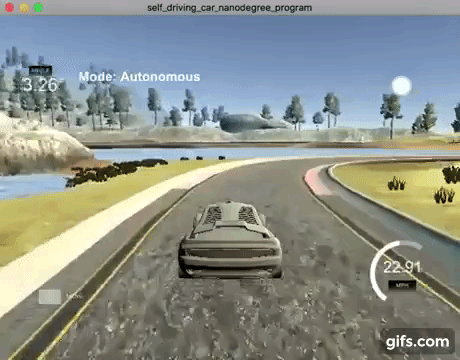
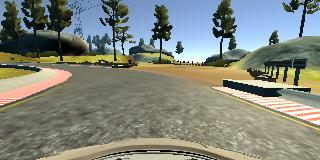

[](https://youtu.be/lf2Ji0vmS14)

---

**Behavioral Cloning Project**

The goals / steps of this project are the following:
* Use the simulator to collect data of good driving behavior
* Build, a convolution neural network in Keras that predicts steering angles from images
* Train and validate the model with a training and validation set
* Test that the model successfully drives around track one without leaving the road
* Summarize the results with a written report

## Rubric Points
###Here I will consider the [rubric points](https://review.udacity.com/#!/rubrics/432/view) individually and describe how I addressed each point in my implementation.  

---
###Files Submitted & Code Quality

####1. Submission includes all required files and can be used to run the simulator in autonomous mode

My project includes the following files:
* model.py containing the script to create and train the model
* drive.py for driving the car in autonomous mode
* model.h5 containing a trained convolution neural network. This file is not on github but can be downloaded [here](https://s3.amazonaws.com/vinceypchan/carnd/model.h5)
* writeup_report.md summarizing the results

####2. Submission includes functional code
Using the Udacity provided simulator and my drive.py file, the car can be driven autonomously around the track by executing 
```sh
python drive.py model.h5
```
Note: Please download the model.h5 file from [here](https://s3.amazonaws.com/vinceypchan/carnd/model.h5). Due to the size of the file, it's not hosted on github with the rest of the project.

####3. Submission code is usable and readable

The model.py file contains the code for training and saving the convolution neural network. The file shows the pipeline I used for training and validating the model, and it contains comments to explain how the code works.

###Model Architecture and Training Strategy

####1. An appropriate model architecture has been employed

My model adapts from the model in [Nvidia End to End Learning for Self-Driving Cars](http://images.nvidia.com/content/tegra/automotive/images/2016/solutions/pdf/end-to-end-dl-using-px.pdf) paper.

1. The first layer is a Cropping2D layer that crops the top 70 and bottom 25 pixels. This removes regions that don't contain useful information.
2. Next is a Lamba layer that normalizes the input images.
3. Next are 5 different convolutional layers. Each convolutional layers use RELU activation to introduce nonlinearity.
4. Next are 3 fully connected layers, each with a drop out layers in between to reduce overfitting.

####2. Attempts to reduce overfitting in the model

The model contains 3 dropout layers in order to reduce overfitting. Each with a drop probability of 0.5.

The model was trained and validated on different data sets to ensure that the model was not overfitting. The data is split into two subset. 80% of the data is used for training, and 20% is used for validation. The model was tested by running it through the simulator and ensuring that the vehicle could stay on the track.

####3. Model parameter tuning

The model used an adam optimizer, so the learning rate was not tuned manually.

The model has 3 dropout layers. I have experimented drop out rate between 0.2 and 0.5 and finally settled on 0.5.

I used batch size of 32 and trained for 5 epochs. I found that the loss doesn't improve after 5 epoch.

####4. Appropriate training data

I used the data from Udacity data set with preprocessing and data augmentation. There are a few issues that need to be addressed in order to get a good model with that dataset.

* The dataset was obtained from driving around track 1. This track is mostly straight road. As a result, majority of the samples have zero steering angle. We need to under sample the images with zero steering angle, otherwise the model will bias toward zero steering.
* The left steering and right steering samples are not balanced in the dataset. This can be easily resolved by flipping horizontally for all samples. After this process, we will have same number of left vs right steering samples.
* The data does not have much if any recovery examples. To teach the car recovery once it's off center, we apply the same concept that's used in the Nvidia paper and utilize the images from left and right camera with a CORRECTION rate of 0.15.

For details about how I preprocess the training data, see the next section. 

###Model Architecture and Training Strategy

####1. Solution Design Approach

My first step was to use a convolution neural network model similar to the the model in [Nvidia End to End Learning for Self-Driving Cars](http://images.nvidia.com/content/tegra/automotive/images/2016/solutions/pdf/end-to-end-dl-using-px.pdf) paper. I thought that model was appropriate because it's a similar problem. In fact, it's more powerful than what we need here since we are only dealing with two tracks with limited scenery. 

Next, I modified the model to add a lamda layer to normalize the the images. I also added a few dropout layers after each fully connected layers. I also split my image and steering angle data into a 80% training and 20% validation set.

Next, I trained a model to drive in the simulator to verify that I have working pipeline. Without other data preprocessing, I used the center steering in udacity dataset to train the model and tested it in the simulator. The car drove straight off track in the first big turn.

Once I have a working pipeline, I started working on analysing and preprocess the dataset. The code and steps of the data exploration and preprocessing can also be found in the preprocessing.ipynb notebook. 

##### Steering angle distribution


From the steering distribution, we can tell that majority of the samples have zero or low steering angles. This would create a model that is bias toward driving stright. We can also see that the dataset have very few samples for sharp turns (samples with large steering angles), and the left and right steering samples aren't balanced.

##### Balance Left and Right steering
We flip any images horizontally that have non-zero steering, and multiply the corresponding steering angle by negative one. This not only doubles the number of samples that have non-zero steering angles, it also balances the number of left steering vs right steering. This has the effect of collecting data while driving in opposite direction of the track. Following is the steering distribution after flipping. The left and right side are exact mirror of each other.


Following two images show the effect of flipping an image horizontally. 




##### Using left and right camera images
The car in the simulator has three cameras. See examples below. By applying the concept described in the Nvidia paper, we use left and right camera images and apply a correction offset to teach the car how to recover from off center. The correction rate I chose is 0.15. I found that it's good enough to get around the sharp turn without making the driving too jittery. Using the left and right camera images on top of the center camera images also have the nice effect of tripling the sample size.


##### Zero steering samples
I divide all samples into 21 bins. From each bin, I choose up to 500 samples. This will undersample the zero and low steering angle groups that are over represented in our data.

##### Final Steering Distribution
This is the final steering distribution of the samples. We have 5206 samples to work with.


At the end of the process, the vehicle is able to drive autonomously around the track without leaving the road. See the link on top of the file to view it in action.

I had tested with the comma ai architecture described [here](https://github.com/commaai/research/blob/master/train_steering_model.py). But after the initial experiments and data exploration, I found that this project is much about collecting and processing the training data rather than the architecture of the network. 

####2. Final Model Architecture

The final model architecture consisted of a convolution neural network with the following layers and layer sizes:
```sh
Layer (type)                     Output Shape          Param #     Connected to                     
____________________________________________________________________________________________________
cropping2d_1 (Cropping2D)        (None, 65, 320, 3)    0           cropping2d_input_1[0][0]         
____________________________________________________________________________________________________
lambda_1 (Lambda)                (None, 65, 320, 3)    0           cropping2d_1[0][0]               
____________________________________________________________________________________________________
convolution2d_1 (Convolution2D)  (None, 33, 160, 24)   1824        lambda_1[0][0]                   
____________________________________________________________________________________________________
convolution2d_2 (Convolution2D)  (None, 17, 80, 36)    21636       convolution2d_1[0][0]            
____________________________________________________________________________________________________
convolution2d_3 (Convolution2D)  (None, 9, 40, 48)     43248       convolution2d_2[0][0]            
____________________________________________________________________________________________________
convolution2d_4 (Convolution2D)  (None, 9, 40, 64)     27712       convolution2d_3[0][0]            
____________________________________________________________________________________________________
convolution2d_5 (Convolution2D)  (None, 9, 40, 64)     36928       convolution2d_4[0][0]            
____________________________________________________________________________________________________
flatten_1 (Flatten)              (None, 23040)         0           convolution2d_5[0][0]            
____________________________________________________________________________________________________
dropout_1 (Dropout)              (None, 23040)         0           flatten_1[0][0]                  
____________________________________________________________________________________________________
dense_1 (Dense)                  (None, 1164)          26819724    dropout_1[0][0]                  
____________________________________________________________________________________________________
dropout_2 (Dropout)              (None, 1164)          0           dense_1[0][0]                    
____________________________________________________________________________________________________
dense_2 (Dense)                  (None, 100)           116500      dropout_2[0][0]                  
____________________________________________________________________________________________________
dropout_3 (Dropout)              (None, 100)           0           dense_2[0][0]                    
____________________________________________________________________________________________________
dense_3 (Dense)                  (None, 50)            5050        dropout_3[0][0]                  
____________________________________________________________________________________________________
dense_4 (Dense)                  (None, 1)             51          dense_3[0][0]                    
____________________________________________________________________________________________________
Total params: 27,072,673

Trainable params: 27,072,673

Non-trainable params: 0
```

Here is a visualization of the architecture:


#### Conclusion
This is a really fun project. It really shows the importance of having quality data, no good model architecture can overcome bad training data. The information shared by other students in forum and slack channel provided really helpful and probably saved countless hours of more trial and errors.